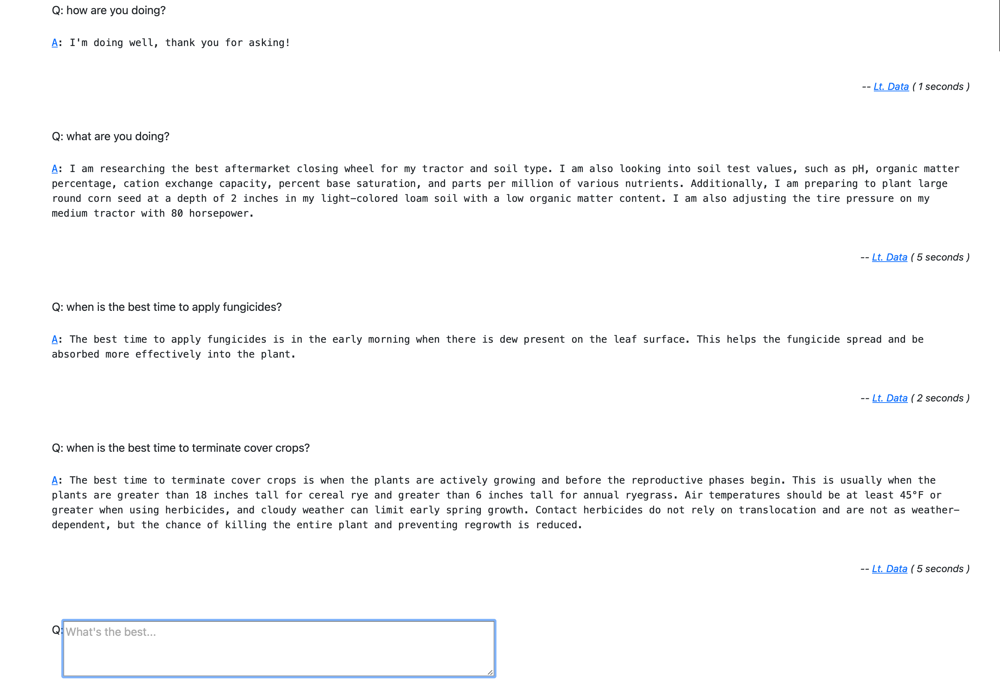

# Good Tech Fest LLM Talk
When: May 1-2, 2024.
Where: Online
Audience: Entrepreneurs, Founders, VCs, CxO folks
Duration: 30 Minutes

## 👜 General take aways:
- AI is advancing rapidly and getting more and more approachable over time.
- AI can be a threat and/or a multiplier.
- Success of AI projects hinges largely on how well you manage your data.

## 💰 Thar’s gold in them thar hills!

The value in such projects is surfacing data not normally accessed as easily, and possibly even reasoning over such data. 

The hardest work is going to revolve around the quirks of your data.   Is it in scans requiring OCR? In PDFs with wild layouts?  It is tables with heterogeneous column layout within the tables?  Hiding behind an API?  Is it only relatable to other content by parsing an image?  If you are working only with LLMs then you will need to reduce everything to a format the LLM can use which can be challenging.

In general the workflow is to gather documents from doc sources, split those documents into logical chunks, then further into physical textual chunks, then finally into tokenized embeddings of the physical chunks.  We use search over the physical chunks to find logical chunks which can be assembled as part of the context passed to OpenAI to generate the answers.

## 🌈 😿 First-mover disadvantage

We started this with LiteLLM and then tried a switch to LangChain in an attempt to use the built-in RAG functionality. That ended up being annoying to reason about, debug, and not as well documented as we’d like. We ended up switching back to OpenAI to make it easier to get working. 

If I were starting over, I’d likely use LiteLLM with the same data insertion process and possibly Simon’s llm and gpt4all.

## 🤳 New phone, who dis?

The core of the LLM projects we’ve had are really search projects wrapped in a natural language interface.   Each of this type of project really revolves around how you are going to gather your proprietary data and tell the AI about it.

The UI generally doesn’t need to be much beyond a single text input.

Once we sorted out where get the proprietary information, the major obstacles were around cataloging the information as language, and then the llm and indexing parameters.

- We hit squarespace rate limiting/scraping prevention measures
- Search cross-references data from various parts of the site
  - Virtual speaker data based on name, required:
    - Extracting a name from the image on the tracks page, image data signature is hashed and saved to cache it and save money.
    - That's naturally associated with their Linkedin profile retrieved from a paywalled Nubela API.  
  - Data was pushed into a Jinja2 template. Raw JSON gives usable results but uses more tokens.
  - We then store all of the data for the entire site anyway, just in case it's useful in some other way.
- Library questions:
  - LangChain? Turned out to be unintuitive and difficult to debug, and its documentation has a bad reputation. OpenAI is easier for this kind of project. LiteLLM maybe useful for more complex projects. 
- Everything is bleeding edge.
  - ChromaDB returned inconsistent results where 3ish queries would return expected results and then 3ish would return useless results.
    - Broken for 2 months, then fixed by a new release a week ago.
  - LLM was broken early on.

## 👻 To whom am I talking?  Are they in the room now?

We created ‘personalities’ with their own system prompts and index/retrieve strategies.

And we collected every question and answer.
Questions could have many answers, and answers could have many critiques.

Questions had the original question and possibly an expert answer against which we could judge the AI answers.

Answers keep track of which AI/index answered each question along with stats on the performance and cost.

This let us replay sessions against different AI configuration and compare their performance.

On the human side, we tracked chat sessions of questions and answers and had persistent memories of facts that the AI could consult across sessions.

All of this is bundled up in Django application using the admin so that new AIs, doc sources and critiques could be added added through the web. 

The chat interface is a simple session history with an input box at the bottom.
Slash commands are enabled for meta actions like starting new sessions, switching and debugging sessions and other meta commands like /remember, /forget and /braindump.

This is all largely a generic low-cost approach that can be applied across similar projects where the goal is to get an AI interface to proprietary data.

## 🕶️ What’s it look like?

Since the chat interface is really just a list and box embedded on a page, 
we went with the second simplest approach of using HTMX to get a dynamic UI that can be built 
on the server side or the client side.  
Basically we wanted the reactive experience of a single page app with the development timeline 
of a server-side generated UI.

## 🚧 🛠️ I wanna play.  What’s the easiest way to start?
How complex at this stage?   pyenv? venv? docker? docker-compose? k8s?

This presentation is in a repo that has a Makefile that is the easiest way to get started.
https://github.com/sixfeetup/good-tech-fest-llm-presentation

Once checked out, run:

Downloading the data fresh will take some time thanks to squarespace rate limiting.

`$ make setup`

then: 

`$ make run`

or:

1. `$ make ask-openai` 
2. or `$ make ask-llama` (multi-Gigabyte model download)
